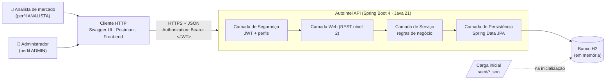
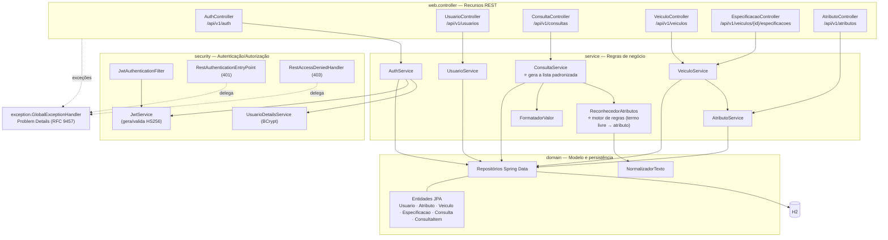
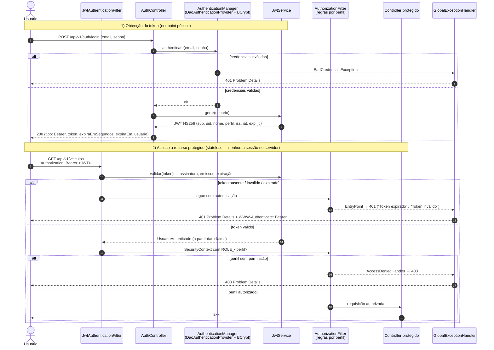
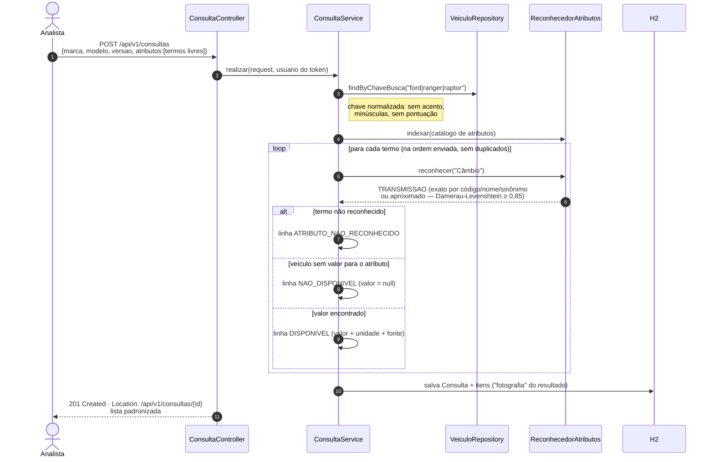
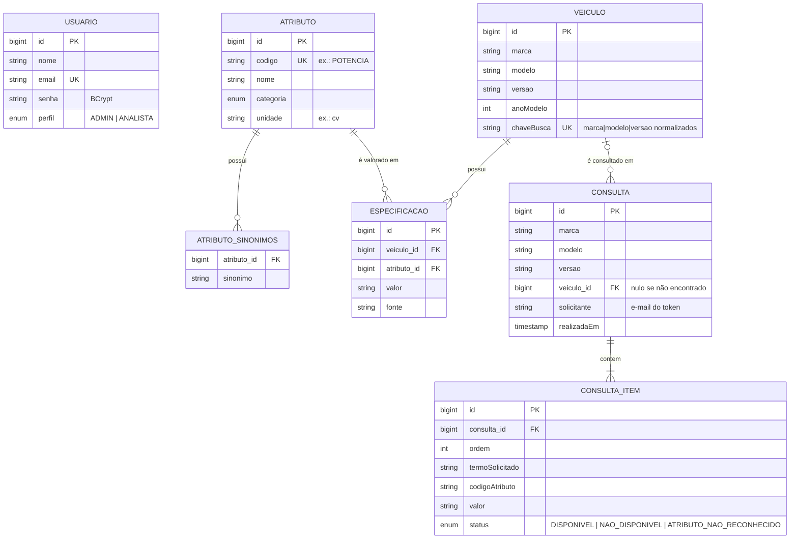

# Arquitetura da Solução — AutoIntel

> API REST de **Inteligência Competitiva Automotiva**: recebe *marca, modelo, versão* e uma **lista livre de atributos técnicos** e devolve uma **lista padronizada de especificações**, sempre no mesmo formato, com ausência de dados explícita.

## 1. Visão geral (contexto)



## 2. Componentes e responsabilidades



| Camada / Pacote | Responsabilidade | Não faz |
|---|---|---|
| `web.controller` | Mapear recursos e métodos HTTP, validar entrada (`@Valid`), escolher status code e headers (`Location`), converter DTOs | Regra de negócio, acesso a banco |
| `web.dto` | Contratos de entrada/saída (records imutáveis) — isolam a API das entidades | Lógica |
| `security` | Emitir e validar JWT, montar o usuário autenticado a partir das claims, responder 401/403 | Regras de negócio |
| `config` | Regras de acesso por rota/perfil (`SecurityConfig`), OpenAPI, carga inicial | — |
| `service` | Casos de uso: consulta padronizada, reconhecimento de atributos, CRUDs, controle de dono da consulta | Conhecer HTTP |
| `domain` | Entidades, invariantes (ex.: unicidade marca/modelo/versão normalizada) e repositórios | Conhecer HTTP ou DTOs |
| `exception` | Traduzir exceções em respostas de erro padronizadas | — |

## 3. Fluxo de autenticação (JWT)



**Decisões de segurança**

- **Stateless:** o servidor não guarda sessão; o JWT carrega `uid`, `nome` e `perfil`, evitando ida ao banco a cada requisição.
- **Expiração** configurável (`app.jwt.expiracao`, padrão 1h) e validada com relógio injetável (testável).
- **Emissor** (`iss`) validado: tokens de outros sistemas, mesmo com a mesma chave, são rejeitados.
- **Senhas** com BCrypt; mensagem de login inválido não revela se o e-mail existe.
- **Defesa em profundidade:** regras por rota no `SecurityConfig` **e** `@PreAuthorize` nos métodos de escrita.
- **Controle por dono:** um ANALISTA só lê/remove as próprias consultas (403 caso contrário); ADMIN vê todas.
- **Promoção de perfil** apenas por ADMIN (`PATCH /usuarios/{id}/perfil`); o novo perfil vale a partir do próximo token.

### Perfis e permissões

| Recurso | Público | ANALISTA | ADMIN |
|---|:---:|:---:|:---:|
| `POST /auth/login`, `POST /usuarios` (cadastro) | ✅ | ✅ | ✅ |
| `GET /atributos/**` (catálogo) | ✅ | ✅ | ✅ |
| Swagger UI, `/v3/api-docs`, `/actuator/health` | ✅ | ✅ | ✅ |
| `GET /auth/me` | ❌ | ✅ | ✅ |
| `POST/GET/DELETE /consultas/**` | ❌ | ✅ (só as próprias) | ✅ (todas) |
| `GET /veiculos/**` (inclui especificações) | ❌ | ✅ | ✅ |
| `POST/PUT/DELETE /veiculos/**`, `/atributos/**` | ❌ | ❌ | ✅ |
| `GET /usuarios/**`, `PATCH /usuarios/{id}/perfil` | ❌ | ❌ | ✅ |

## 4. Fluxo da consulta padronizada (núcleo do desafio)



**Por que um motor de regras (e não IA generativa)?** O desafio permite qualquer abordagem. Optamos por regras determinísticas (normalização + sinônimos + tolerância a erros de digitação) porque:
1. **Consistência:** o mesmo pedido sempre gera a mesma saída — requisito central ("formato sempre o mesmo").
2. **Rastreabilidade:** cada valor tem `fonte`; nada é "inventado". Quando não há dado, a saída diz explicitamente `NAO_DISPONIVEL`.
3. **Extensível sem código:** novos atributos/sinônimos entram pela API (`POST /atributos`) ou pelo `seed/atributos.json`.

A arquitetura em camadas permite, no futuro, plugar um provedor de IA/scraping como fonte adicional de especificações dentro do `service`, sem alterar os contratos REST.

## 5. Modelo de dados



## 6. Maturidade REST — Nível 2 (Richardson)

| Critério | Como foi atendido |
|---|---|
| **Recursos** identificados por URI (substantivos) | `/usuarios`, `/atributos/{codigo}`, `/veiculos/{id}`, `/veiculos/{id}/especificacoes/{codigoAtributo}` (sub-recurso), `/consultas/{id}` |
| **Verbos HTTP** com semântica correta | `GET` leitura (seguro/idempotente) · `POST` criação · `PUT` substituição idempotente · `PATCH` alteração parcial (perfil) · `DELETE` remoção |
| **Status codes** coerentes | `200` leitura/atualização · `201` + `Location` criação · `204` remoção · `400` validação · `401` token ausente/inválido/expirado · `403` sem permissão · `404` inexistente · `405` método · `409` conflito · `415` mídia |
| **PUT idempotente** criando ou substituindo | `PUT /veiculos/{id}/especificacoes/POTENCIA` → `201` na 1ª vez, `200` nas seguintes |
| **Negociação de conteúdo** | `GET /consultas/{id}` com `Accept: application/json` ou `Accept: text/csv` |
| **Paginação** | `GET /consultas?page=0&size=20&sort=realizadaEm,desc` |
| **Versionamento** | prefixo `/api/v1` |

## 7. Tratamento de erros

Todas as respostas de erro — inclusive as geradas pelo Spring Security (401/403) e pelo Spring MVC (404/405/415) — seguem o **Problem Details (RFC 9457)**, com `Content-Type: application/problem+json`:

```json
{
  "type": "https://autointel.fiap.com.br/erros/validacao",
  "title": "Requisição inválida",
  "status": 400,
  "detail": "Um ou mais campos são inválidos.",
  "instance": "/api/v1/consultas",
  "codigo": "VALIDACAO",
  "timestamp": "2026-09-26T22:09:52.113Z",
  "erros": [ { "campo": "marca", "mensagem": "não deve estar em branco" } ]
}
```

O `RestAuthenticationEntryPoint` e o `RestAccessDeniedHandler` delegam ao `GlobalExceptionHandler` via `HandlerExceptionResolver`, garantindo **um único ponto** de formatação de erros.
